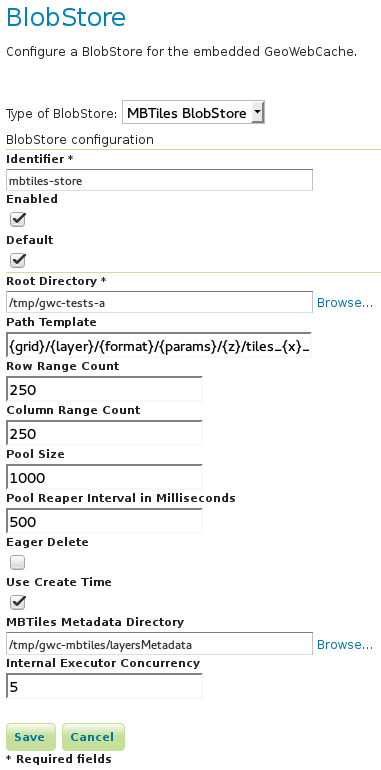

.. _community_gwc_sqlite:

GWC SQLite Plugin
=================

This plugin provides integration with GWC SQLite based blob stores. At the moment only one blob store of this type is available, the MBTiles blob store.

MBTiles BlobStore
-----------------

This blob store allow us to store tiles using the `MBTiles <https://github.com/mapbox/mbtiles-spec/blob/master/1.1/spec.md>`_ specification (version 1.1) which defines a schema for storing tiles in an `SQLite <https://www.sqlite.org/>`_ database with some restrictions regarding tiles formats and projections.

MBTiles specification only supports JPEG and PNG formats and projection EPSG:3857 is assumed. The implemented blob store will read and write MBTiles files compliant with the specification but will also be able to write and read MBTiles files that use others formats and projections.

Using the MBTiles blob store will bring several benefits at the cost of some performance loss. We will be able to store our data with a significantly smaller number of files, which will help us avoid file system headaches and help us managing our data. In some cases the stored data will be more compacted reducing the size of the data on disk.

When compared to the file blob store this store as two limitations:

* This store will not integrate with disk quota, this is a consequence of using database files.
* **This store cannot be shared among several GeoWebCache instances.**

When managing this store files we should keep in mind that we are not dealing with simple files but databases files. When connections to a database file are open we should not delete, move or switch the associated file (or we may corrupt the databases files). Databases files can become fragmented after deleting an huge amount of data or after frequent inserts, updates or delete operations.

File Path Templates
~~~~~~~~~~~~~~~~~~~

An MBTiles file will correspond to an SQLitle database file. In order to limit the amount of contention on each single database file we will allow users to decide the granularity of the databases files. When GeoWebCache needs to map a tile to a database file it will only look at the databases files paths, it will not take in account the MBTiles metadata (this is why we are able to handle others formats and projections).

To configure the databases files granularity the user needs to provide a file path template. The default file path template for the MBTiles blob store is this one:

.. code-block:: none

  {grid}\{layer}\{format}\{params}\{z}\tiles_{x}_{y}.sqlite

The provided files paths templates will always be considered relative to the root directory provided as a configuration option.

In this case we are storing our tiles organized by the grid set id, the layer name, the tiles format, the parameters unique hash, the zoom level, column range and row range. The column and row range values are passed by configuration, by default those values are equal to 250.

Follows an example of what the blob store root directory structure may look like when using the default file path template:

.. code-block:: none

  .
  `-- EPSG_4326
      `-- sf_restricted
          `-- image_png
              |-- f0023dc7bc347fee7a3a04dc797f2223f74e3448
              |   `-- 14
              |       `-- tiles_6750_12000.sqlite
              `-- null
                  |-- 10
                  |   |-- tiles_0_0.sqlite
                  |   |-- tiles_250_500.sqlite
                  |   `-- tiles_250_750.sqlite
                  `-- 9
                      |-- tiles_0_0.sqlite
                      `-- tiles_0_250.sqlite

If no parameters were provided *null* string will be used. Is the responsibility of the user to define a file path template that will avoid collisions.

The terms that can be used in the file path template are:

* **grid**: the grid set id
* **layer**: the name of the layer
* **format**: the image format of the tiles
* **params**: parameters unique hash
* **x**: column range, computed based on the column range count configuration property
* **y**: row range, computed based on the row range count configuration property
* **z**: the zoom level

It is also possible to use parameters values, like *style* for example. If the parameter is not present *null* will be used.

.. note:: The file template separators are specific to the operating system used, for example ``\`` for Linux and ``/`` for Windows. Any special char like \, /, : or empty space used in a term value will be substituted with an underscore.

MBTiles Metadata
~~~~~~~~~~~~~~~~

A valid MBTiles file will need some metadata, the image format and layer name will be automatically added when an MBTiles file is created. The user can provide the remaining metadata using a properties file whose name must follow this pattern:

.. code-block:: none

  <layerName>.metadata

The directory that contains this metadata files is defined by a configuration property.

Expiration Rules
~~~~~~~~~~~~~~~~

The MBTiles specification don't give us a way to know when a tile was created. To allow expire rules we use an auxiliary table were we will store that information. In the presence of an MBTiles file generated by a third party tool we will assume that the create time of a tile was the first time it was accessed. This feature can be activated or deactivated by configuration. Note that this will not break the MBTiles specification compliance.

Eager Truncate
~~~~~~~~~~~~~~

When performing a truncate of the cache we should always try to remove the whole database file avoiding to create fragmented space. This is not suitable for all the situations and is highly dependent on the database files granularity. The configuration property ``eagerDelete`` allows us to disable or deactivate this feature which is disabled by default.

Configuration Example
~~~~~~~~~~~~~~~~~~~~~

Follows as an example the default configuration of the MBTiles store:

The *rootDirectory* property defines the location where all the files produced by this store will be created. The *templatePath* property is used to control the granularity of the database files (see section above). Properties *rowRangeCount* and *columnRangeCount* will be used by the path template.

The *poolSize* property allow us to control the max number of open database files, when defining this property we should take in account the number open files allowed by the operating system. The *poolReaperIntervalMs* property controls how often we will check the pool size to see if we need to close some database files. 

Property *eagerDelete* defines if we should remove a whole database file or instead perform a delete query. The property *useCreateTime* can be used to activate or deactivate the insertion of the tile creation time (see section above). Property *executorConcurrency* controls the parallelism used to perform certain operations, like the truncate operation for example. Property *mbtilesMetadataDirectory* defines the directory where we should look for user provided MBTiles metadata.

Replace Operation
~~~~~~~~~~~~~~~~~

As said before, if the cache is running we cannot simply switch SQLite files, we need to make sure that all connections are closed. The replace operation was created for this propose. The replace operation will first copy the new file side by side the old one, then block the requests to the old file, close the connections tot he old file, delete the old one, rename the new file to current one, reopen the new db file and start serving requests again. Should be almost instant.

A REST entry point for this operation is available, it will be possible to submit a ZIP file or a single file along with the request. We can also ask the replace operation to use an already present file or directory. When using a directory the directory structure will be used to find the destination of each file, all the paths will be assumed to be relative to the store root directory. This means that if we want to replace a store content with another store content (a seeded one for example) we only need to ZIP the second store root directory and send it as a replacement and the seeded store content will me merged with the first store content.

There is four ways to invoke this operation. Follows an example of all those variants invocations using CURL.

Replace a single file uploading the replacement file:

.. code-block:: none

  curl -u admin:geoserver -H 'Content-Type: multipart/form-data'
    -F "file=@tiles_0_0.sqlite"
    -F "destination=EPSG_4326/sf_restricted/image_png/null/10/tiles_0_0.sqlite"
    -F "layer=sf:restricted"
    -XPOST 'http://localhost:8080/geoserver/gwc/rest/sqlite/replace'

Replace a single file using a file already present on the system:

.. code-block:: none

  curl -u admin:geoserver -H 'Content-Type: multipart/form-data'
    -F "source=/tmp/tiles_0_0.sqlite"
    -F "destination=EPSG_4326/sf_restricted/image_png/null/10/tiles_0_0.sqlite"
    -F "layer=sf:restricted"
    -XPOST 'http://localhost:8080/geoserver/gwc/rest/sqlite/replace'

Replace multiple files uploading a ZIP file:

.. code-block:: none

  curl -u admin:geoserver -H 'Content-Type: multipart/form-data'
    -F "file=@tiles.zip"
    -F "layer=sf:restricted"
    -XPOST 'http://localhost:8080/geoserver/gwc/rest/sqlite/replace'

Replace multiple files using a directory already present on the system:

.. code-block:: none

  curl -u admin:geoserver -H 'Content-Type: multipart/form-data'
    -F "source=/tmp/tiles"
    -F "layer=sf:restricted"
    -XPOST 'http://localhost:8080/geoserver/gwc/rest/sqlite/replace'

The *layer* parameter identifies the layer whose associated blob store content should be replaced. The *file* parameter is used to upload a single file or a ZIP file. The *source* parameter is used to reference an already present file or directory. The *destination* parameter is used to define the file that should be replaced with the provided file.

This are the only valid combinations of this parameters other combinations will ignore some of the provided parameters or will throw an exception.